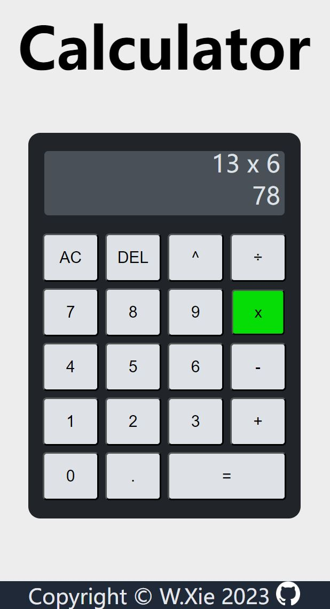

# Calculator
 Basic calculator app created using HTML, CSS, and JavaScript.

The calculator supports mathematical operations of addition, subtraction, multiplication, division, and exponentiation. Additionally, it can clear and undo numbers.

 In accordance with The Odin Project's calculator assignment instructions, this calculator is designed to evaluate only a single pair of numbers at a time. For example, in the expression "12 + 7 - 5 * 3," the correct result should be 42, not 4.

 [Live Demo](https://weizhixie.github.io/odin-calculator/)

 # Screenshot

